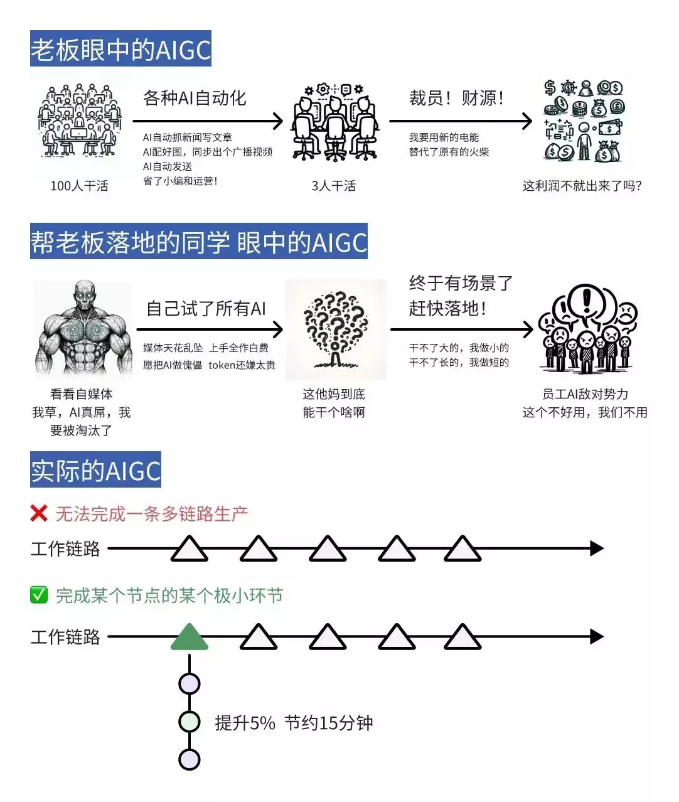

# AI工作流01 認識AI mindmap

## 使用AI

### 使用AI的思維
* <iframe width="450" height="255" src="https://www.youtube.com/embed/KoT08Kno10A" title="YouTube video player" frameborder="0" ></iframe>  

* (X) 我有一個任務 -> 找AI去做 -> AI做不好 -> AI好爛
  * 
    * 圖片來源：[领先99%小白的Sora关键信息！](https://www.hellobit.com.cn/doc/2024/32159115.html)

* (O) 我有一個AI -> 找這個AI能做的任務給它做 -> AI完成了

## 典範轉移

### (典範轉移前期)工作流使用舉例
* 繪師 - 找參考
  * <iframe width="450" height="255" src="https://www.youtube.com/embed/xT8-N9xlOrI" title="YouTube video player" frameborder="0" ></iframe>  
  * 資料參考 (取代pinterest)
  * 構圖參考
* 編劇 - 讓AI分工
  * 查找參考資料
  * 主題發想
  * 填表格
* 數據分析 - 讓AI分析資料
  * 讓AI製作圖表
  * 套用數據分析模型
* 寫程式 - 讓AI當junior
  * 跟AI討論架構
  * 讓AI寫部分程式碼
* 學語言 - 讓AI當老師
  * 對話
  * 出題目
  * others....
* 寫文章 - 內容處理
  * 寫大綱讓AI去完成文章
  * 總結一篇文章
  * 詢問細節
* 語音轉文字
  * 快速生成初版
* 科研輔助
  * 由AI尋找藥物  
* AI音樂輔助
  * track split
  * AI作曲

### (典範轉移後期)提升價值舉例
* 小說家使用AI幫忙繪圖
* 概念設計使用AI實驗想法
* AI幫忙製作小AI工具助手
* ChatGPTs當助手
* podcast語音辨識，能分類與插入廣告
* AI速產加密貨幣新聞

## AI的能力
* 無限猴子理論
  * 你猜我答
    * 
* Transformer
  * 全局思維
* (未來)
  * 長期推論Q*, AlphaCodeII

## 使用AI的方式

### 現階段 
* 具備Domain Knowledge
* 轉換成格式文字(未來不需要這步)

### Hacking技巧
* GPT
* DALLE 3
* GPTs

## 作業