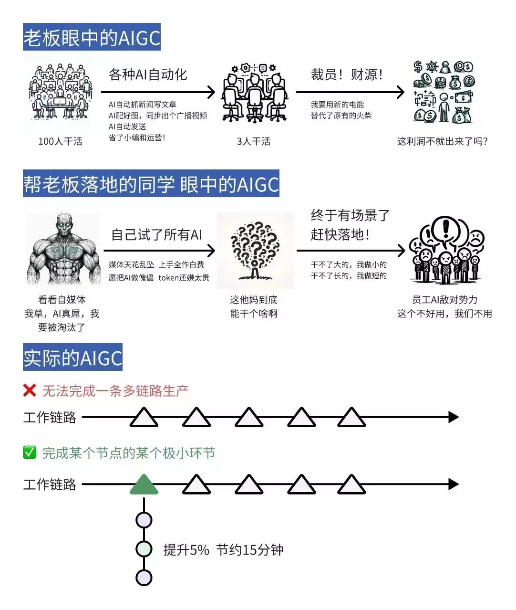
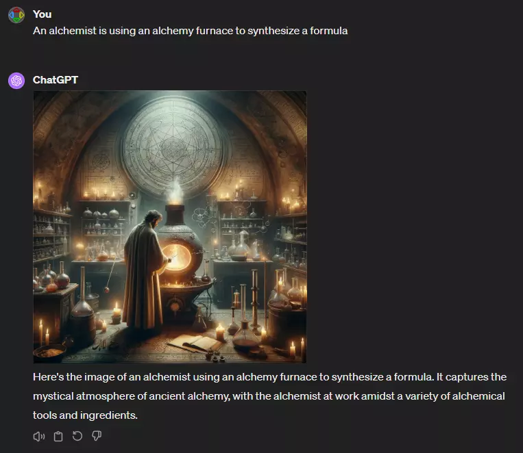
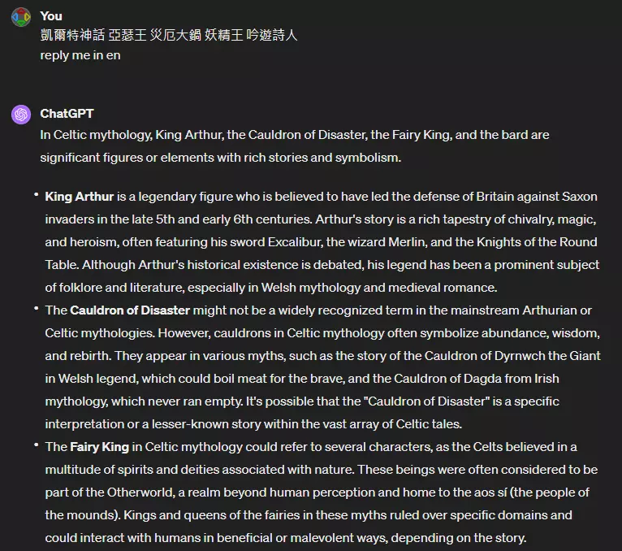
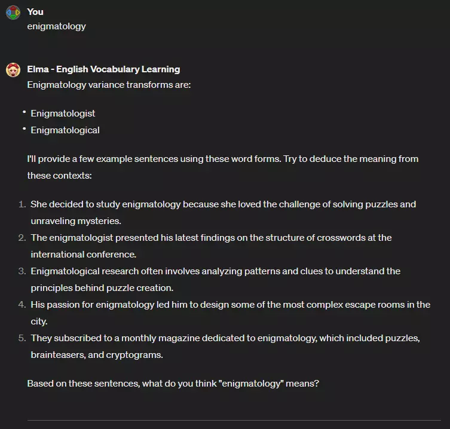
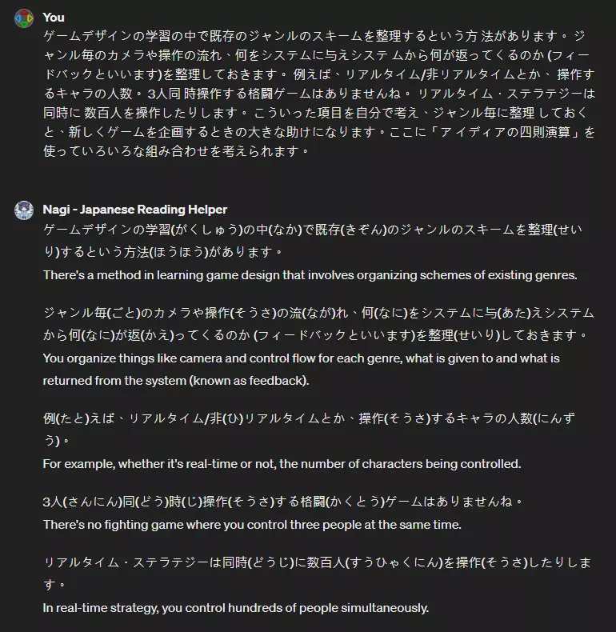

# AI工作流01 認識AI Slides

## AI工作流01 認識AI

### 現在的AI到底是什麼?

* 無限猴子理論
    * 
* 聖經密碼
    * 
    * 

## 使用AI的思維

* 
(X) 我有一個任務 -> 找AI去做 -> AI做不好 -> AI好爛

* 
(O) 我有一個AI -> 找這個AI能做的事給它 -> AI完成任務

* 典範轉移前期:
  * 常見現象 - AI不好用
    *   
      * 圖片來源：[领先99%小白的Sora关键信息！](https://www.hellobit.com.cn/doc/2024/32159115.html)

## 典範轉移

典範轉移(Paradigm shift)

* 紀實攝影(Photo Documentary)
  * 
    * 圖片來源：wiki
* Montage - Kuleshov effect
  * <iframe width="450" height="255" src="https://www.youtube.com/embed/_gGl3LJ7vHc" title="YouTube video player" frameborder="0" ></iframe>  

* 標靶藥物 Halicin

## AI下棋打牌
* 圍棋AI - KataGo
  * 
* 日麻AI - NAGA
  * 
* 撲克AI和GTO理論
  * 
    * 圖片來源:[GTO Poker 101: Master Game Theory Optimal Implications](https://www.pokercode.com/blog/gto-poker)

## 範例：輔助作曲
* track split
  * [WaveTone｜AI分軌](https://www.youtube.com/watch?v=8EzGb6d18kw)
* AI作曲

## 範例：繪師
### 繪師 - 找參考
* 資料參考 (取代pinterest)
* 構圖參考
* <iframe width="450" height="255" src="https://www.youtube.com/embed/xT8-N9xlOrI" title="YouTube video player" frameborder="0" ></iframe>  
*   
*   

## 範例：編劇
### 編劇 - 讓AI分工
  * 查找參考資料
    *   
  * 主題發想
  * 填表格
    * [Beat Sheet](https://alchemy.posetmage.com/Novel/Arcanum/Settings/Main%20Story)
    * [Character](https://alchemy.posetmage.com/Novel/Arcanum/Settings/Medina)

## 範例：文章
### 寫文章 - 內容處理
* 寫大綱讓AI去完成文章
* 總結一篇文章
* 詢問細節

### 寫文案 - 當寫手
* 給他文案的知識
* 逐步迭代修改

### 寫日記
* GPTs

## 範例：數據分析

### 讓AI分析資料
  * 讓AI製作圖表
  * 套用數據分析模型

### 問卷
* 問卷需要存成檔案
* [分析問卷](https://ai.posetmage.com/Boards/Money/2023-07-30-AI%E5%88%86%E6%9E%90%E5%95%8F%E5%8D%B7.html)

## 範例：寫程式

### 讓AI當junior
* 跟AI討論架構
* 讓AI寫部分程式碼

### Devin

## 範例：學語言

### 讓AI當老師
* 對話
* 出題目
* GPTs
  *   
  *   

## 範例：上字幕
### 語音轉文字
  * 快速生成初版，再人工修正

### 影片轉語言 
* 結合deepfake
  * [AI讓 Taylor Swift 說流利中文](https://www.facebook.com/intleconobserve/videos/%E7%95%B6ai%E4%B9%9F%E8%83%BD%E8%AE%93-taylor-swift-%E8%AA%AA%E6%B5%81%E5%88%A9%E4%B8%AD%E6%96%87/713753216815295/)
  * Rask AI

## 範例：生成影片

### Stable Video Diffusion
* <iframe width="450" height="255" src="https://www.youtube.com/embed/ZyltBRaAc3g" title="YouTube video player" frameborder="0" ></iframe>

### Sora

  
## 典範轉移後期
* 小說家使用AI幫忙繪圖
* 概念設計使用AI實驗想法
* AI幫忙製作小AI工具助手
* ChatGPTs當助手
* podcast語音辨識，能分類與插入廣告
* AI速產加密貨幣新聞

## AI的能力

* Transformer
  * 全局思維
* (未來)
  * 長期推論Q*, AlphaCodeII

## 作業
* 使用GPT4
* 思考問題類型
  * 典範轉移前期：少量替代，高度軍備競賽的紅海，需要高品質
  * 典範轉移後期：全新設計，降維打擊的藍海市場，不須高品質
* 影片
  * <iframe width="350" height="255" src="https://www.youtube.com/embed/KoT08Kno10A" title="YouTube video player" frameborder="0" ></iframe>  
  * <iframe width="350" height="255" src="https://www.youtube.com/embed/zWk69IPsMQs" title="YouTube video player" frameborder="0" ></iframe>  
  * <iframe width="350" height="255" src="https://www.youtube.com/embed/b8Bx2oNJWlI" title="YouTube video player" frameborder="0" ></iframe>  

