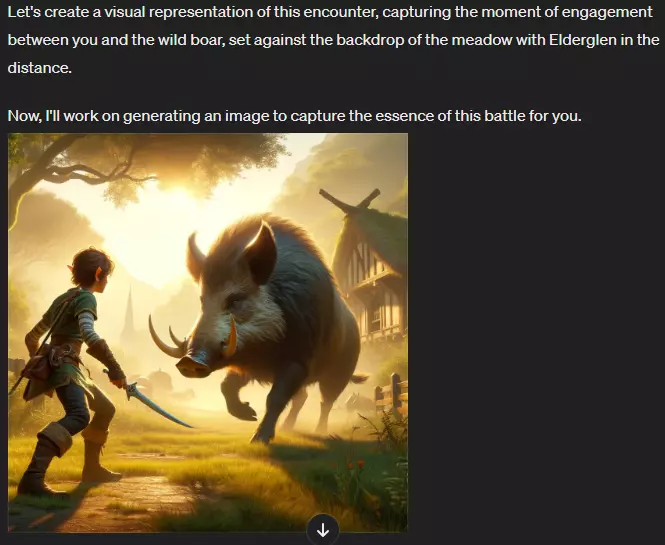
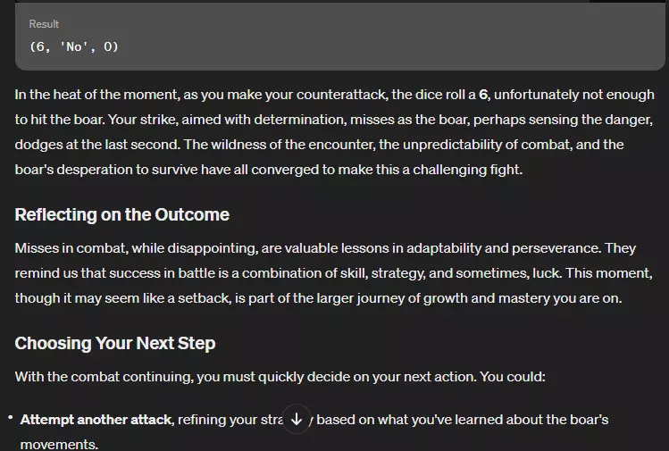

# AI工作流02 Scalability slides

## 理解AI方式
* 觀察 → 假設 → 實驗

* 看AI相關技術說明
  * Transformer
  * 大語言模型
  * RAG(Retrieval Augmented Generation)

## 操作AI實驗
* 角色扮演
  * 
  * 
  * 
* 發揮創意
  * 
  * 
  * 
* Hacking

## Prompt範例
* 

## 工業化流程思維

### 提問的藝術
好的問題能夠清晰定義目標，界定範圍，並指引數據收集與分析的方向。在實踐中，這意味著：
* 明確與具體：問題應該是清晰且具體可衡量的，以便於定義成功的標準。
* 分解問題：複雜的問題可以分解為更小、更易於管理的子問題。
* 背景知識：結合領域內的背景知識來形成問題，這有助於確定哪些因素是關鍵的。

## 迭代思維
* 實驗AI的隨機性：嘗試固定prompt觀察AI的行為pattern
* 容錯與學習：接受失敗作為過程的一部分，從中調整直到獲得想要的結果

### 標準化
開發標準化的工具、框架和協議，以便於在不同的領域和應用中重複使用AI解決方案。
* 流程優化：利用AI進行流程優化
* 公規：定義通用的介面，比如使用固定的格式與文字排版。

## 範例：說話的藝術
* 
* 

## 範例：繪圖AI
* [對話](./02/Hack%20DALLE.html)
* 版權拒絕
  * 
* 繞過
  * 
* 嘗試繪圖
  * 
* 修prompt失敗
  * 
* 再修
  * 
* 結果
  * 

## GPTs範例

## 作業
* 使用
  * GPT4
  * GPT copilot
  * DALLE 3
  * GPTs
* 思考如何做到量產

