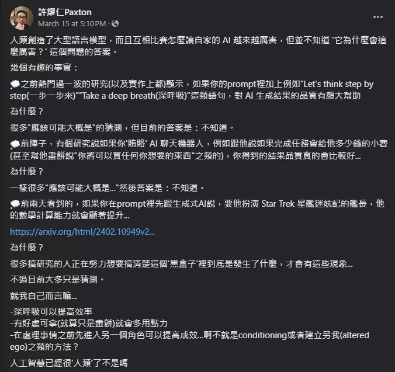
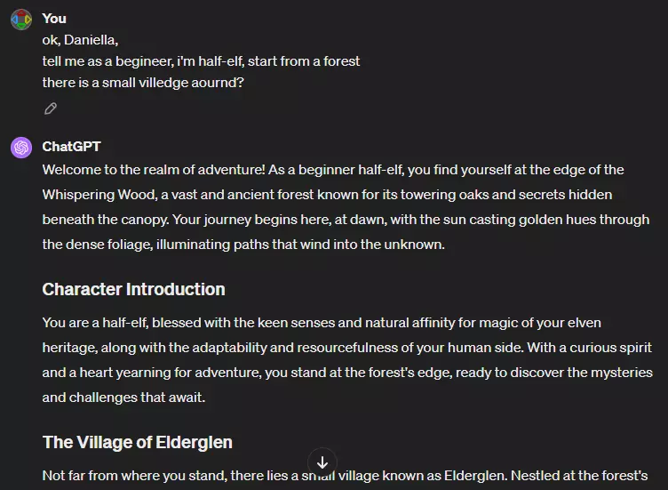
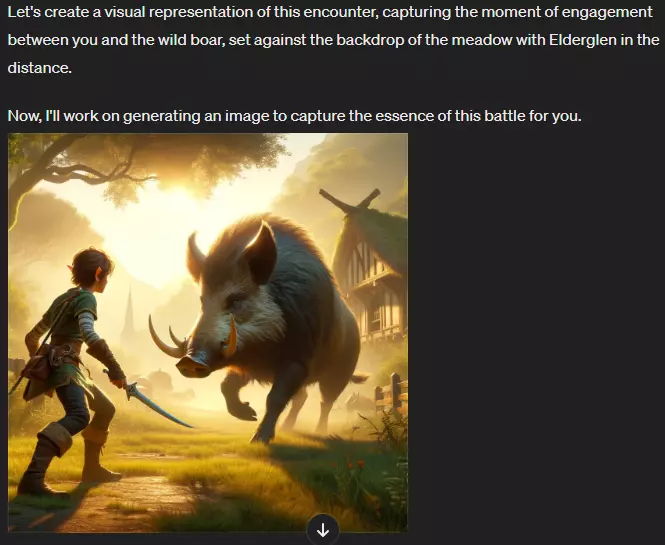
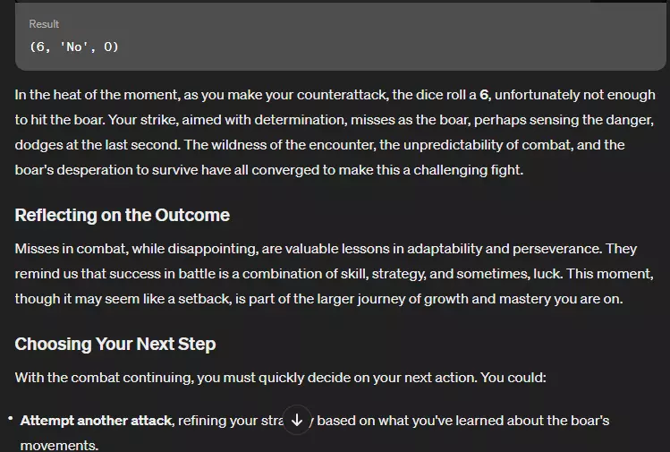
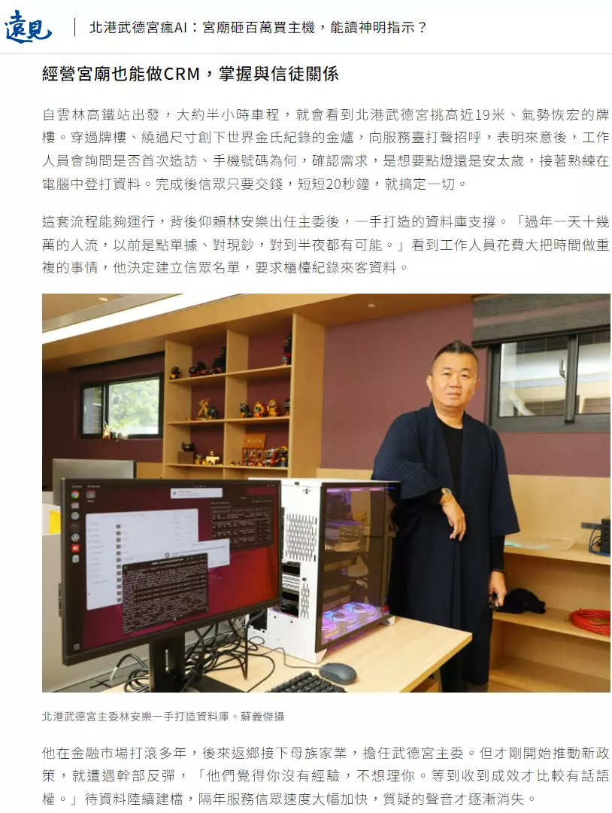
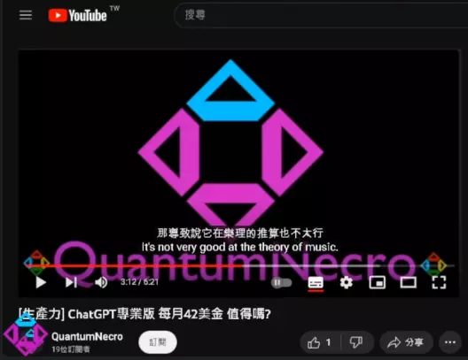

# AI工作流02 價值導向 Slides

## Prompt範例
* 
* 說話的藝術
  * 
  * 

## 理解AI方式
* 觀察 → 假設 → 實驗

* 看AI相關技術說明
  * Transformer
  * 大型語言模型(LLM)
  * RAG(Retrieval Augmented Generation)

* 
  * 圖片來源: https://twitter.com/sfdxpro/status/1627760386882650112

## 操作AI實驗
* 角色扮演
  * 
  * 
  * 
* 發揮創意
  * 
  * 
  * 
* Hacking
  * 

## 價值導向
* Richard Feynman: You Should Have 12 Favorite Problems
  * Marathon - Long term project
  * Sprint - Short term project
* 投入的資源需要跟問題大小成正比
  * 複雜問題需要複雜工具
  * 避免殺雞用牛刀
* 解決需求舉例
  * 軟體工程
  * 繪師
  * 翻譯
  * 遊戲全語音

* 舉例：宮廟現代化
  * 
* 舉例：AI輔助寫日記
  * <iframe width="350" height="255" src="https://www.youtube.com/embed/ZRv0Z-M7NqM" title="YouTube video player" frameborder="0" ></iframe>  
  * <iframe width="350" height="255" src="https://www.youtube.com/embed/3xW97NmAh1s" title="YouTube video player" frameborder="0" ></iframe>  

## 工業化流程思維

### 價值問題
* Context：好的前後文能夠清晰定義目標，界定範圍。
* 明確與具體：問題應該是清晰且具體，甚至可衡量。
* 分解問題：複雜的問題可以分解為更小、更易於管理的子問題。
* 背景知識：結合領域內的背景知識來形成問題，這有助於確定哪些因素是關鍵的。

### 迭代思維
* 實驗AI的隨機性：嘗試固定prompt觀察AI的行為pattern
* 容錯與學習：接受失敗作為過程的一部分，從中調整直到獲得想要的結果

### 標準化
開發標準化的工具、框架和協議，以便於在不同的領域和應用中重複使用AI解決方案。
* 流程優化：為AI設計流程
* 公規：定義通用的介面，比如使用固定的格式與文字排版。

## 迭代範例

### 概念設計
* <iframe width="350" height="255" src="https://www.youtube.com/embed/c9-MrCqcC6E" title="YouTube video player" frameborder="0" ></iframe>  

### 分析問卷
* [中英問卷結果合併](https://ai.posetmage.com/Boards/Money/2023-07-30-AI%E5%88%86%E6%9E%90%E5%95%8F%E5%8D%B7.html)

### DALLE3
* [對話](./02/Hack%20DALLE.html)
* 版權拒絕
  * 
* 繞過
  * 
* 嘗試繪圖
  * 
* 修prompt失敗
  * 
* 再修
  * 
* 結果
  * 

## 生產線範例
* 節點替換
  * 寫筆記: markdown → Obsidian, vscode
  * 心智圖: markdown → markmap
  * 寫書: markdown → html → epub/pdf
  * 架站: markdown → Jekyll → github website → Slides
  * 企劃書： [yml → html](https://posetmage.com/GameDesign/Tool/)
  * [影片上雙語字幕](https://github.com/LatticeMage/Tools/tree/main/Subtitle#flow)
    * 
    
### 商業化案例
* <iframe width="350" height="255" src="https://www.youtube.com/embed/dcrhhIKNaRQ" title="YouTube video player" frameborder="0" ></iframe>  

## 問題導向範例
[GPTs](https://ai.posetmage.com/GPTs/)

## 作業
* 價值問題
* 使用
  * GPT4
  * GPT copilot
  * DALLE 3
  * GPTs
* 影片
  * <iframe width="350" height="255" src="https://www.youtube.com/embed/5kNCcpM61eo" title="YouTube video player" frameborder="0" ></iframe>  
  

