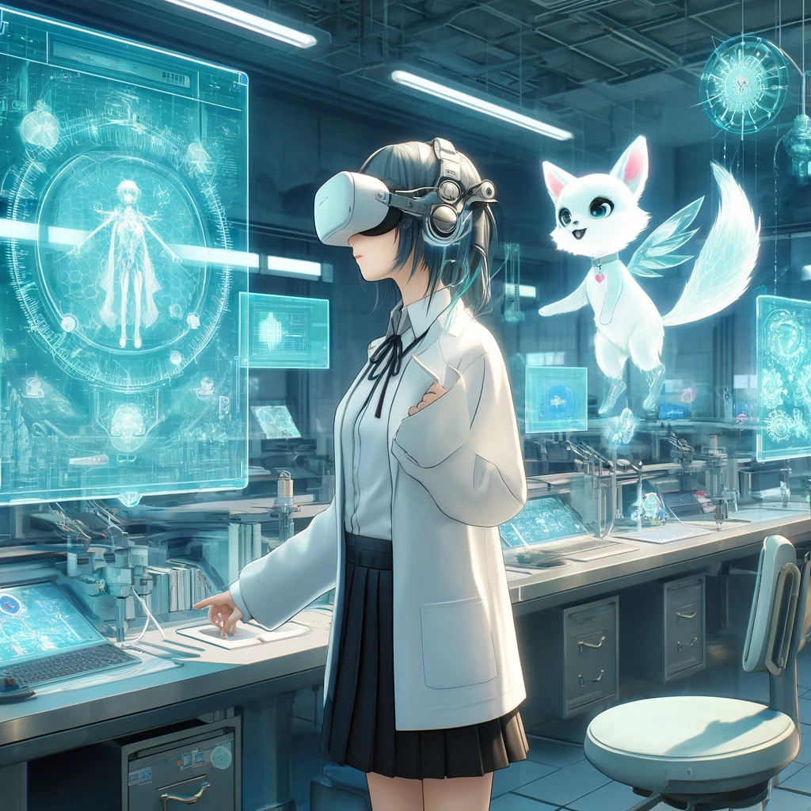
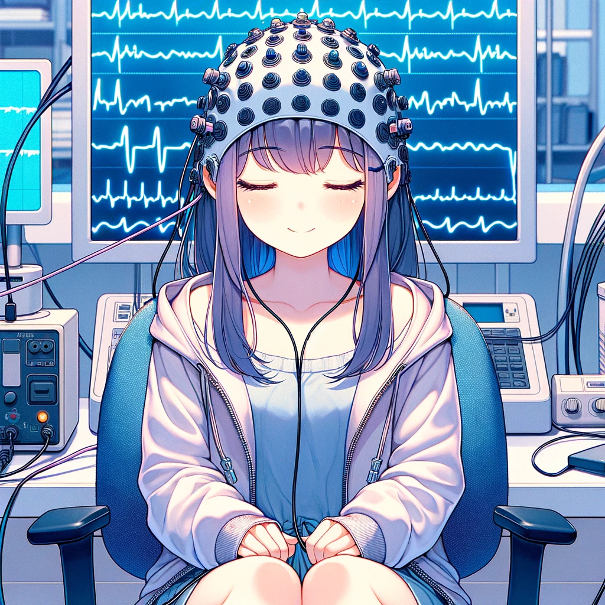
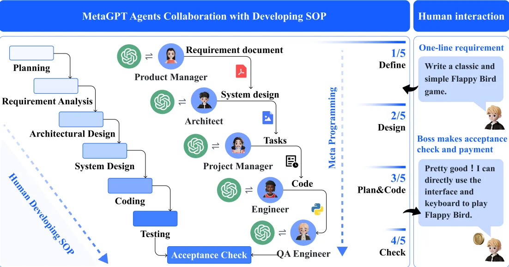
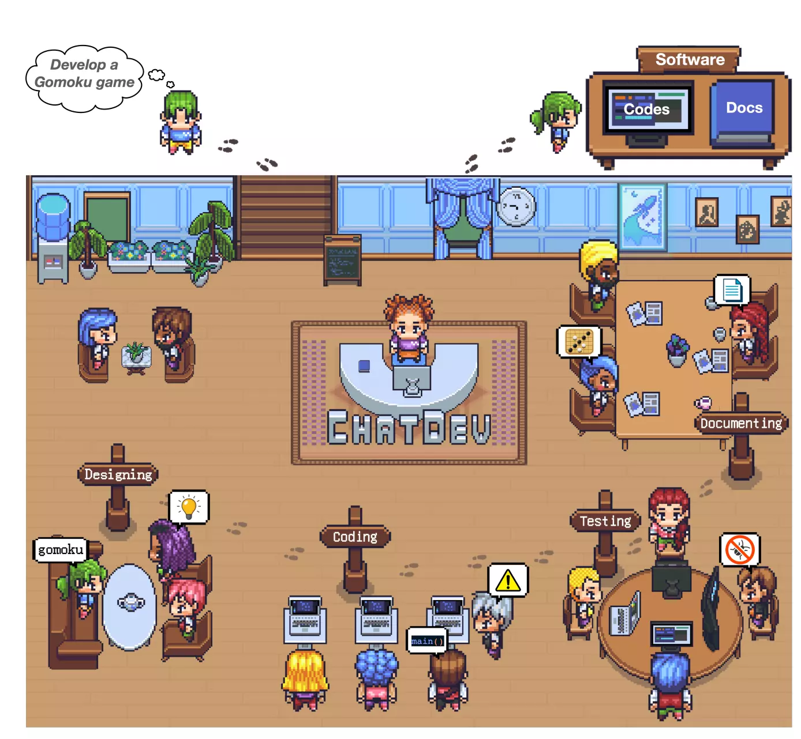
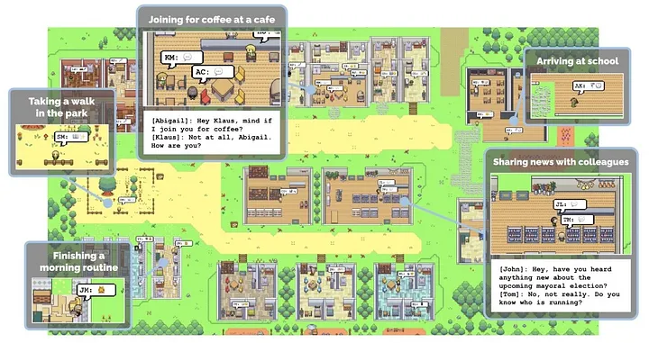

# AI工作流03 生產線管理 Slides

## AI Agent
* 記憶
  * RAG
  * 規劃
* 行動
  * 使用工具

## Research: VR UX

### Problem
* VR Keyboard

### impossible triangle
* Privacy
* Efficiency
* Lightweight

### Related concepts
* Notebook
  * [唠唠云游戏：你的下台游戏本，何必是游戏本](https://www.youtube.com/watch?v=qH8AVOz5Gdg)
* Local LLM
  * [《M2 Ultra：干翻英伟达！决战AI之巅》](https://www.youtube.com/watch?v=UsfmqTb2NVY)
* hardware cost
  * NVIDIA H100 x 2 ~ USD 60,000
  * mac studio M2 ~ USD 6,000
  * AMD APU 8700G ~ USD 600

### Possible Solution
* AI Agent
  * 
* EEG
  * 

## Multi-Agent

### MetaGPT 

### ChatDev

### AI villagers
* Generative Agents: Interactive Simulacra of Human Behavior
  * 
  * [圖片來源](https://pub.aimind.so/generative-agents-interactive-simulacra-of-human-behavior-ec15fbb50543)

## solopreneur
* <iframe width="350" height="255" src="https://www.youtube.com/embed/UADDTfgeZdE" title="YouTube video player" frameborder="0" ></iframe>  
  * Hung-yi Lee【生成式AI導論 2024】第5講：訓練不了人工智慧？你可以訓練你自己 (下) 

## Develop Framework
source: [[2023 TGDF] 極度邊緣的開發方式 (黃仕成)](https://www.youtube.com/watch?v=yV0aYkDtqp8)
* Early Discussion
  * .webp)
* Pre-Production
  * .webp)
  * .webp)
  * .webp)
* Production
  * .webp)
* Post-Production
  * .webp)
  * .webp)

## Paradigm shift
* 生產者 → 決策者
* Multi Domain Knowledge

