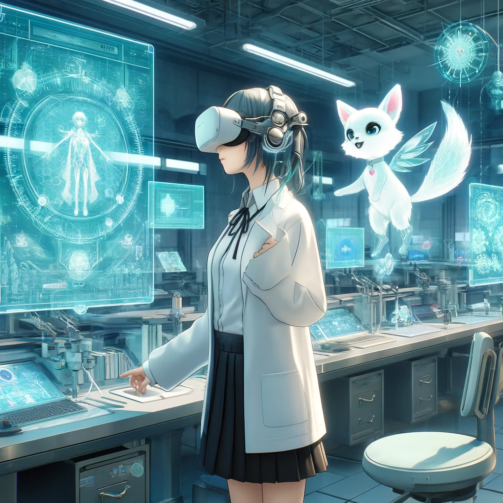
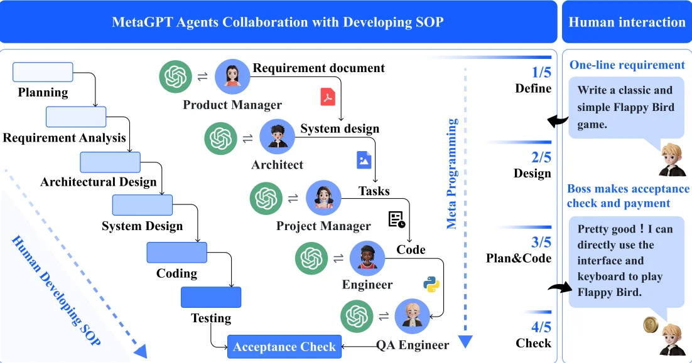

# AI工作流04 AI生產線 Slides

## How humans interact with the world
* Information Gathering (Past):
  * apply information on chaos
  * we need learn information
* Knowledge Application (Present):
  * apply knowledge on info
  * we need to learn knowledge
* Experience Utilization (Future with AI): 
  * apply experience on knowledge
  * we should learn experience

## Paradigm shift
* Executor → Decision Maker
* Progress → End-to-End
* Central Decision → Distributed Decision
  * AI company
* Q*, AlphaCode 2

## Evolution
* What is possible?
* What is likely to happen?
* What is desirable to have happen?

## value question
* Identify a problem that becomes increasingly solvable or manageable with the progression of technology.
* The focus is on advancements that enhance usability and effectiveness over time, rather than on updates that make learning and using new software more cumbersome.

## Research: VR UX

### Problem
* VR Keyboard

### impossible triangle
* Privacy
* Efficiency
* Lightweight

### Related concepts
* Notebook
  * [唠唠云游戏：你的下台游戏本，何必是游戏本](https://www.youtube.com/watch?v=qH8AVOz5Gdg)
* Local LLM
  * [《M2 Ultra：干翻英伟达！决战AI之巅》](https://www.youtube.com/watch?v=UsfmqTb2NVY)
* hardware cost
  * NVIDIA H100 x 2 = NT$2,600,000
  * mac studio M2 = NT$260,000
  * AMD APU 8700G = NT$26,000

### Possible Solution
* AI Agent
  * 
* EEG
  * 

## Multi-Agent

### MetaGPT 

### ChatDev

### AI villagers
* Generative Agents: Interactive Simulacra of Human Behavior
  * 
  * [圖片來源](https://pub.aimind.so/generative-agents-interactive-simulacra-of-human-behavior-ec15fbb50543)

### AI Agent for project management
* role
  * task manager
  * scheduler
  * advisier
* papers:
  * Using AI to train teams of robots to work together
  * Training teams of robots to work together using AI
  * Multi-Agent Collaboration: Harnessing the Power of Intelligent LLM Agents

### Develop Framework
source: [2023 TGDF] 極度邊緣的開發方式 (黃仕成) 
* Early Discussion
  * .webp)
* Pre-Production
  * .webp)
  * .webp)
  * .webp)
* Production
  * .webp)
* Post-Production
  * .webp)
  * .webp)

