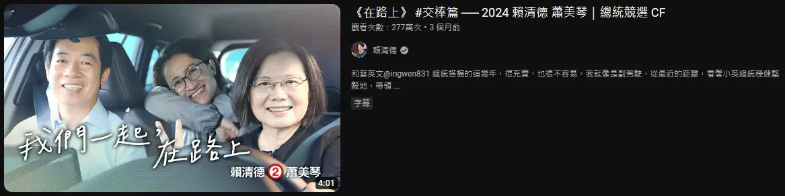

# AI工作流04 Case Study - SEO Slides

## Case Study

* SEA + SEO = SEM
* 解決問題原則
* 高品質文章
* Youtube平台演算法的演變
* Google的唯一性政策與懲罰措施
* Growth Hacking策略實例
* 理解與幫助使用者
* 網站內容策略
* 高效網站設計
* AI工作流

## SEA vs SEO

* 主動推播 vs 被動推播
* 主動收入 vs 被動收入
* 花錢下廣告 vs 花時間產內容
* 廣撒 vs 精準集中
* 短期流量 vs 長期成效
* 流量型 vs 產品型

### SEA + SEO = SEM

### Optimization
「關鍵字 流量」＝「關鍵字 搜尋量」x「關鍵字 點閱率(排名)」

## 搜尋意圖
* TA導向原則
* "乾我屁事"原則
  * TA設定
    * 搜尋情境
  * 解決問題導向
* 理解使用者
  * 負評
    * steam, google,
      * 不能葉配味道

## YT不同時期算法

* 2006-2010年：
  * 初期發展，YouTube內容多樣但不專業，用戶尋求新奇和娛樂性。
* 2011-2014年：
  * 內容創造者崛起，YouTube推出合作夥伴計劃和直播功能，平台推廣長影片。
* 2015-2019年：
  * 多樣化內容時期，平台推廣中短影片，大頻道多角觸及。
* 2020年至今：
  * 後疫情時代，專業領域的小頻道成為主流。
  * 分眾化時代
* 2030 ~ ?：
  * MR時代

## 高品質內容
### E-E-A-T 原則
Google 的 "E-E-A-T" 原則是評估內容品質的一種指導方針，主要應用於其搜尋引擎的評分系統。

* 專業性 (Expertise):
  * 內容創作者應該具備相關領域的專業知識。對於健康、法律或財務等高度專業化的主題，專業性特別重要。
* 經驗 (Experience):
  * 這是 Google 新增的評估標準，強調創作者除了理論知識外，還應有實際操作或個人經歷的展示，這可以提供更多實用的見解和建議。
* 權威性 (Authoritativeness):
  * 指內容及其創作者在其領域內被認為是權威來源的程度。這通常透過專業認證、出版書籍或被其他權威來源引用來展示。
* 可信度 (Trustworthiness):
  * 內容需要來自可信的來源，並且能夠讓讀者感到信賴。這包括正確性、透明度(如公開披露利益衝突)以及安全性(如使用 HTTPS)。

### 搜尋指導
Google Quality Raters Guidelines

### 七比三
70%資料查找：30%內容生產

* ex:
  * Tech.wav哈利每周花20hr在找資料，約8hr錄製+剪輯
  * 林亦高品質的長片做不到雙週更

### 輔助讀者
* 白話
* 圖文並茂

### 長效型內容 vs 跟風熱門短效
* 多平台內容策略
* m觀點 -> m報, 科技巨頭解碼
* 山道猴子、巨人完結篇、......

## 關鍵字
* 熱門關鍵字
* 長尾關鍵字

### Google Ads
* 關鍵字規劃工具
* 關鍵字搜尋量
  * 難度分析

### 關鍵字出現位置
* ★★★★★ 標題(Title)
* ★★★★★ 開頭前100字
* ★★★★★ 連結文字(Anchor Text)
* ★★★★☆ 段落(Headings)
* ★★★☆☆ 內容本體(Main Content)
* ★★★☆☆ 相關字、同義字
* (×) 關鍵字標籤(Keywords Meta Tag)

## Growth Hacking
* 病毒式分享機制
* 社交媒體戰略
  * ex:蒼藍鴿

### Hook
* 標題殺人、農場標題
  * 終極指南、五分種搞定、這篇就夠了、99%的人都...

### A/B Testing

### PCM(Process Communication Model, PCM)
PCM 是一種心理學工具，用於了解不同人的性格特點和溝通方式。根據這個模型，每個人都有不同程度的六種人格類型，這些類型包括：

* 思想家(Thinker)- 這類人通常理性、組織有序，喜歡計劃和數據分析。
* 持續者(Persister)- 持續者是價值導向、忠誠和意見堅定的人。
* 和諧者(Harmonizer)- 和諧者富有同情心、情感豐富且關心他人。
* 想像者(Imaginer)- 想像者通常內向、創造性強，喜歡夢想和思考。
* 反叛者(Rebel)- 反叛者喜歡創新和非傳統的方法，他們通常風趣且追求樂趣。
* 推銷者(Promoter)- 推銷者是行動導向、風險承擔者，喜歡激勵和影響他人。

### 黑帽SEO vs 白帽SEO

### 評級
#### 評級懲罰
* 相同內容只會出現在Google一次
  * 轉文
* 貓抓老鼠
  * 懲罰洗流量
    * 
  * 自然流量
    * .webp)

## Technical SEO
* Mobile-First
  * User Experience (UX)
  * 
* 讀取效率
  * Webp
* 幫助google爬文
  * Google Search Console
  * Google Analytics
  * sitemap.xml
* 內容自有
  * WordPress
  * 避免平台倒閉
  * 蒐集口袋名單
* Link
  * Internal Link
  * Link Building

## 典範轉移思維

### 紅海思維 vs 藍海思維

### 工作節點
* 製作順序：
  * 問題清單 → 前期研究 → 歸檔 → 知識儲備 → TA設定 → 關鍵字 → 高品質文章  → SEO化 → 社群文章

### 專業領域框架
* 漏斗方向： 
  * 社群媒體(跟風時事文) → 部落格(SEO高品質文章) → 名單 → 產品

* [填表格](./04%20Case%20Study%20Table)

### AI Agents

* AI Agents
  * TA AI
    * 讓AI角色扮演目標TA，用以閱讀文章並判斷是否被TA喜歡      
  * 資料查找AI
    * 上網搜尋資料，提供高品質參考資料與知識儲備
  * 關鍵字分析AI
    * 查詢關鍵字數據，並分析
  * 文章撰寫AI
    * 將查詢資料基於TA需求和關鍵字寫成高品質文章放在個人網站上
  * 平台撰寫AI
    * 基於目前熱們的議題，尋找知識庫將高品質文章發成社群文
  * 流量分析AI
    * 基於數據資料，做流量分析成效，回饋給其他AI
* 文件庫
  * 問題定義
  * TA設定
  * 知識儲備
  * 寫作框架

## References

* Brendan Kane - 鉤引行銷：在訊息爆炸的時代運用鉤引點，只要3秒鐘就能突圍而出
* 阿滴 x 圖文不符 - YouTuber 的 36 堂課：讓你被更多人看到
* 冏星人 - 一寫就圈粉！文字力 x AI 最速打造自媒體影響力
* 許耀仁Paxton
* Jemmy Ko - 讓人一搜尋就找到你
* 邱韜誠 - SEO白話文

