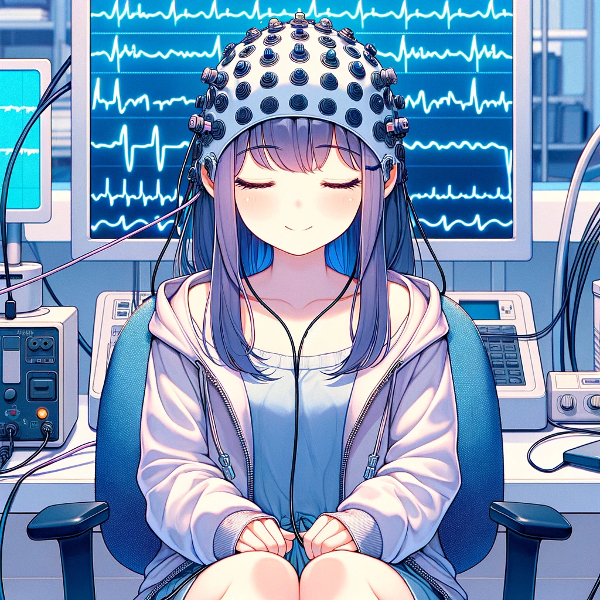

# AI工作流04 設計導向 Slides

## How humans interact with the world
* Information Gathering (Past):
  * apply information on chaos
  * we need learn information
* Knowledge Application (Present):
  * apply knowledge on info
  * we need to learn knowledge
* Experience Utilization (Future with AI): 
  * apply experience on knowledge
  * we should learn experience

## Paradigm shift
* Executor → Decision Maker
* Progress → End-to-End
* Central Decision → Distributed Decision
  * AI company
* Q*, AlphaCode 2

## Evolution
* What is possible?
* What is likely to happen?
* What is desirable to have happen?

## value question
* Identify a problem that becomes increasingly solvable or manageable with the progression of technology.
* The focus is on advancements that enhance usability and effectiveness over time, rather than on updates that make learning and using new software more cumbersome.

## Research: VR UX

### Problem
* VR Keyboard

### impossible triangle
* Privacy
* Efficiency
* Lightweight

### Related concepts
* Notebook
  * [唠唠云游戏：你的下台游戏本，何必是游戏本](https://www.youtube.com/watch?v=qH8AVOz5Gdg)
* Local LLM
  * [《M2 Ultra：干翻英伟达！决战AI之巅》](https://www.youtube.com/watch?v=UsfmqTb2NVY)

### Possible Solution
* AI Agent
  * 
* EEG
  * 
