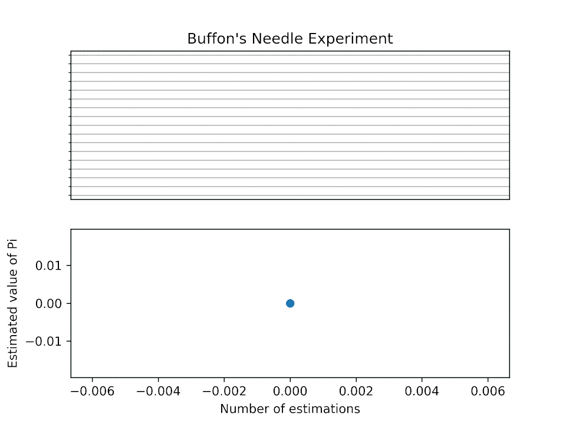

# Artificial Intelligence Overview

## AI Algorithms

### Traditional AI
- Rule-Based Systems
- State Machine
- Fuzzy Logic
- Genetic Algorithm
  - Evolutionary Computation
- A* Search
- Potential Energy
- Decision Tree
- Minimax Algorithm
- Bayesian Networks
  * 貝葉斯思維

### Machine Learning Family
- Statistics
  * Monte Carlo
    *  
      * source: wiki
  * Markov Chain
- Big Data
  * batch process
- Data Mining
  * 關聯學習
    *   
      * source: [Choosing an Optimal Algorithm for AI in Cybersecurity](https://www.vectra.ai/blog/choosing-an-optimal-algorithm-for-ai-in-cybersecurity)
- Supervised Learning
  - Logistic Regression
  - Decision Trees
  - Support Vector Machines
  - Naive Bayes Classifier
- Unsupervised Learning
  - Clustering (K-Means, Hierarchical)
  - Principal Component Analysis
  - Anomaly Detection
- Reinforcement Learning
- Ensemble Learning (Random Forests, Boosting, Bagging)
- Feature Engineering
- Deep Learning
  - Convolutional Neural Networks (CNN)
    * VGG-19
  - Recurrent Neural Networks (RNN)
  - Generative Adversarial Networks (GAN)
  - Deep Reinforcement Learning

### Deep Learning Milestones
- 2012 AlexNet
- 2014 AlphaGo
- 2017 Libratus
- 2017 Transformer
- 2022 ChatGPT

## AI Hardware
- Central Processing Units (CPU)
- Graphics Processing Units (GPU)
  - General-Purpose computing on Graphics Processing Units (GPGPU)
- Tensor Processing Units (TPU)
- Field-Programmable Gate Arrays (FPGA)
- Application-Specific Integrated Circuits (ASIC)
- Neural Processing Units (NPU)
- Quantum Processors

## DL AI Software

### Traditional DL AI Applications
- Image Recognition and Classification
  *   
    * source: [Review of Deep Learning Algorithms for Object Detection](https://medium.com/zylapp/review-of-deep-learning-algorithms-for-object-detection-c1f3d437b852)
- Music Track Splitting
- Speech Recognition
- Natural Language Processing
- Autonomous Vehicles
- Robotics
- Anomaly Detection
- Sentiment Analysis
- Denoising

### AI-Generated Content (AIGC)
- Diffusion Models
  *   
    * source: [Denoising Diffusion Implicit Models](https://keras.io/examples/generative/ddim/)
- Text Applications: Llama 2, ChatGPT, Gemini, Claude, etc.
- Image Generation: DALL·E, Stable Diffusion, Mid-journey, etc.
- Code Generation: GitHub Copilot X, AlphaCode 2, etc.
- Music Generation

## AI Mindset and Workflow

### AI Mindset
- Transformer 全局思維
- 圍棋AI：大局戰略比局部戰術重要
- 日麻AI：整體規劃比幾張牌些微機率差異重要
- 撲克AI：Nash EQ, GTO, exploit
- 訓練多種能力，再做特定任務fine-tuning，performance更好

### AI Workflow Integration
- Integration with existing workflows through text processing and LLM
- Automating repetitive tasks to focus on creative and strategic aspects
- Continuous learning and adaptation to new data and feedback
- Collaborative AI tools enhancing team productivity
