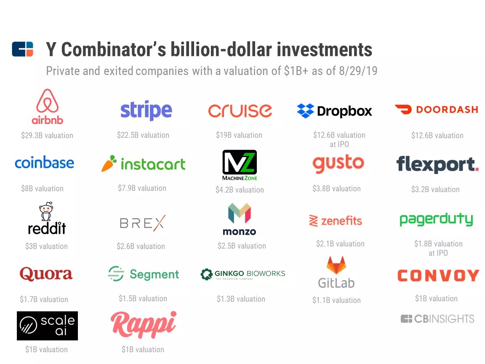
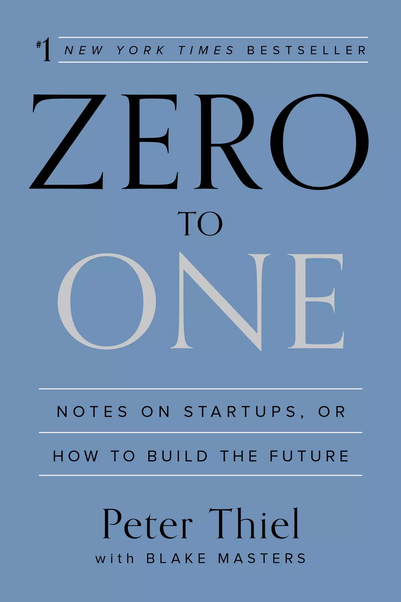
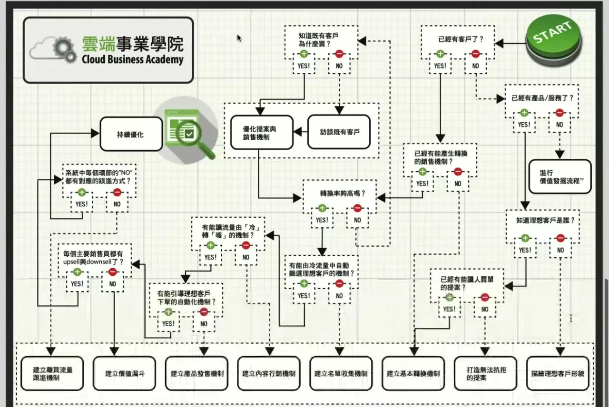

# 創業思維

## Y Combinator
* 創投公司YC
  * 
    * image source: [The Future According To Y Combinator](https://www.cbinsights.com/research/y-combinator-investments/)
* YC[創業課程](https://www.youtube.com/playlist?list=PLQ-uHSnFig5M9fW16o2l35jrfdsxGknNB)
    * <iframe width="450" height="255" src="https://www.youtube.com/embed/BUE-icVYRFU" title="YouTube video player" frameborder="0" ></iframe> 

## 成長
### [安全邊際](https://alchemy.posetmage.com/Content/Social%20Science/Entrepreneurship.html#header-1)
* 創造一個可以無限試錯並且進步的空間
### Resilience
* YC創業第一堂就提到[心智韌性](https://alchemy.posetmage.com/Content/Social%20Science/Psychology/Resilience.html)

## [解決問題導向思維](https://alchemy.posetmage.com/Content/Social%20Science/Entrepreneurship.html#header-3)
* 隨時都要檢查目標是解決核心問題 
  * 第一性原理
* Zero to One
  *   
    * image source: kobo

## 迭代速度
* 時機的重要性
  * <iframe width="450" height="255" src="https://www.youtube.com/embed/bNpx7gpSqbY" title="YouTube video player" frameborder="0" ></iframe>
* 要具備夠快速的問題解決能力

## 決策理論
* 期望值思維
  * 貝葉斯思維
* 決策理論
  * [風險偏好](https://alchemy.posetmage.com/Content/Social%20Science/Psychology/Cognitive/Decision%20Making#header-5)
  * 行為經濟學

## 商業模式
* 市場定位
* 數據分析
* 流量漏斗
* 飛輪效應
* 許耀仁 - 雲端事業學院
  *   
    * image source: [如何建立雲端事業](https://youtu.be/hppb6JP3eQk)