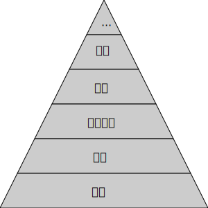

# 專案管理

## 開發流程管理

* 開發框架
    *  [[2023 TGDF] 極度邊緣的開發方式 (黃仕成) ](https://youtu.be/yV0aYkDtqp8)
    * [Slides](https://docs.google.com/presentation/d/1SEad3fuaRG9u78X5sLWwab71ZKbSmEBYQwj0Sv2SYAY/edit)
* 任務管理系統
    * Asana, Monday,.....
    * [Github Org](https://github.com/orgs/)
* 文件管理系統
    * Google Doc,.....
    * Github

## 第一次開會決議事項
* 計劃與目標設立
* 文件

## 一頁式簡報
* [template](./proposal.html)
* [fill data](./proposal.yml)
* [Converter](https://shinra.posetmage.com/GameDesign/Tool/Converter.html)

